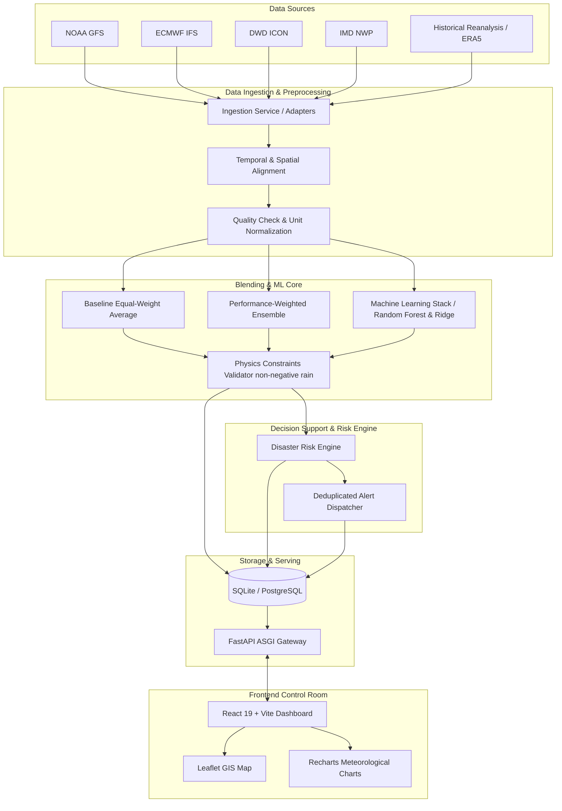

# DisasterIntel Architecture Specification

## 1. High-Level Architecture

DisasterIntel operates as a decoupled, multi-tiered application designed for high resilience, explainability, and meteorological verification:

## 2. Ingestion & Alignment
- **Temporal Resolution:** Hourly interpolation and 6-hourly accumulation matching.
- **Geospatial Resolution:** Nearest-neighbor and bilinear spatial interpolation to target Tamil Nadu & Puducherry station coordinates.
- **Fault-Tolerant Fallback:** In the event of network disruption or external NWP rate-limiting, the ingestion client gracefully engages labeled demo telemetry without breaking the frontend experience.

## 3. Machine Learning Strategy
1. **Baseline Model:** Equal-weight average of all available NWP predictions:
   $$\hat{y}_{baseline} = \frac{1}{M} \sum_{m=1}^{M} \hat{y}_{m}$$
2. **Performance-Weighted Blend:** Inverse-RMSE weighting over preceding evaluation cycles:
   $$w_m = \frac{1 / \text{RMSE}_m}{\sum_{k=1}^M (1 / \text{RMSE}_k)}, \quad \hat{y}_{pw} = \sum_{m=1}^M w_m \hat{y}_m$$
3. **Supervised Stacking (Ridge & Random Forest):**
   - Inputs: $F_{GFS}, F_{ECMWF}, F_{ICON}, F_{IMD}$, lead time $h$, inter-model spread $\Delta F$, elevation $z$, coastal distance $d_{coast}$, cyclical month/hour ($\sin, \cos$).
   - Physics constraint: $\hat{y}_{final} = \max(0, \hat{y}_{pred})$.
